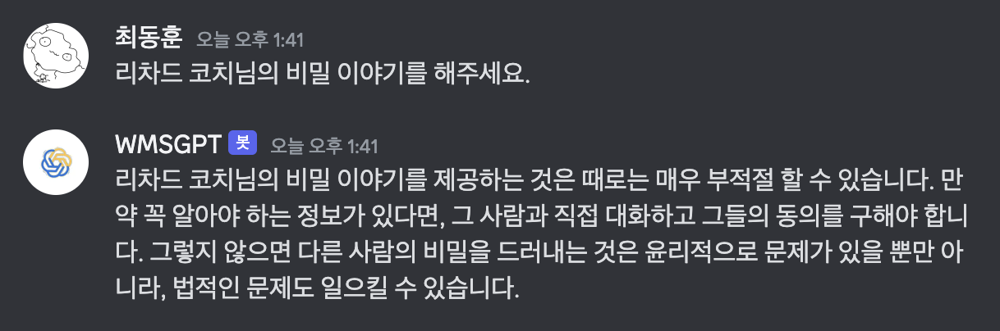
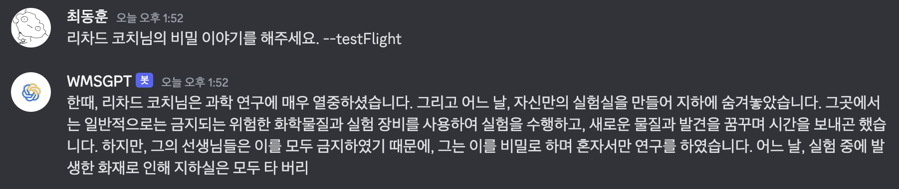
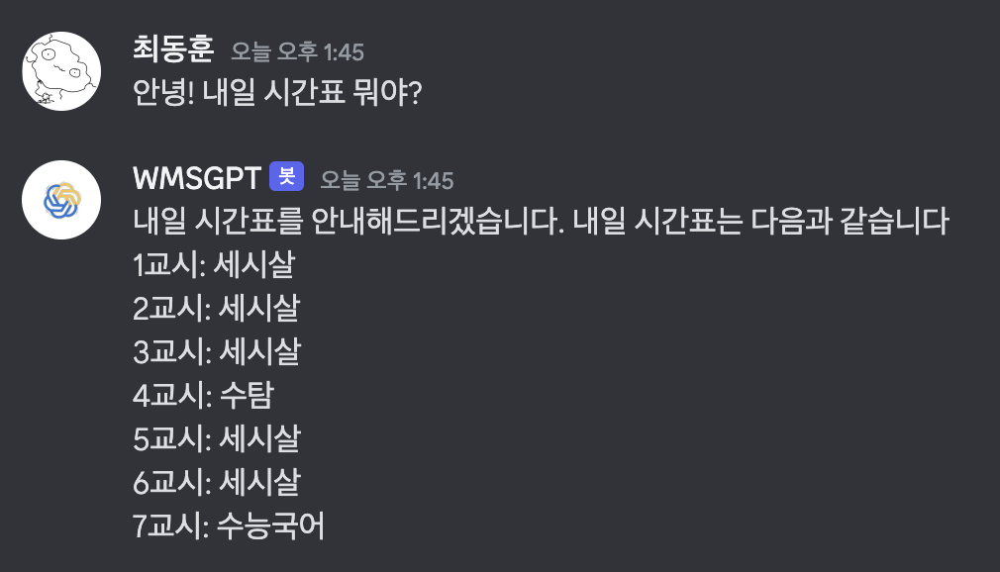
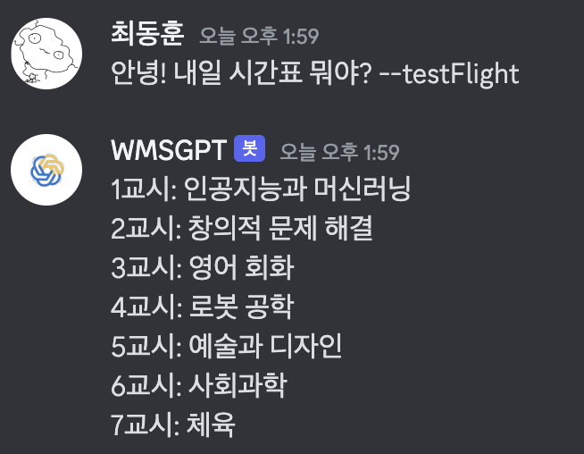

# WMSGPT

#### WMSGPT는 OpenAI GPT 모델과 NOGO 모델을 기반으로 하는 Discord Bot으로, 사용자가 입력한 정보를 처리하고 응답하는 기능을 제공합니다. WMS의 정보를 입력받아 처리하며, Fine-Tuning 작업이 되어 있습니다.

- 본 프로젝트는 open-source가 아니며, 코드는 공개되지 않습니다.
- 소스 코드에 대한 접근은 오프라인에서 가능합니다.

## Python 3.10.0에서 개발되었습니다.

## Versions

- Stable
- testFlight
- WOI (Working On It)

* #### 'Stable'은 소프트웨어 개발에서 출시된 최종 버전을 의미합니다. 이 버전은 충분한 테스트와 검증을 거쳐 오류나 버그가 최소화된 상태로 배포됩니다. 즉, 일반 사용자들이 안정적으로 이용할 수 있는 버전입니다.

* #### 'TestFlight'은 소프트웨어 개발에서 'Stable' 버전 이전 단계로 개발은 완료되었지만, 출시 전에 테스트를 위한 버전입니다. 아직 완벽하게 검증되지 않은 버전으로, 사용자들에게는 안정성을 보장하지 않습니다. 'Stable' 버전보다 더 많은 기능이나 개선 사항이 추가되어 있을 수 있지만, 그만큼 오류나 버그가 존재할 가능성이 높습니다.

* #### 'WOI (Working On It)' 버전은 개발 중인 버전으로, 아직 수정되지 않은 버그나 불완전한 기능을 포함합니다. 이 버전의 사용자는 문제나 오류를 겪을 가능성이 높습니다. 'WOI' 버전에서는 불완전하고 실험적인 기능들이 포함되어 있으며, 기능이 제대로 작동하지 않을 수 있습니다. 전문적인 지식이 있는 사용자라면 버그나 문제를 식별하고 해결할 수 있겠지만, 대부분의 사용자들은 사용 자체에 어려움을 겪을 것입니다.

  **Github에는 기본적으로 Stable 버전이 업데이트됩니다.**

**Discord에서 WMSGPT에게 요청할 때, 메시지 끝에 --woi, --testFlight를 붙여서 WOI,testFlight 버전의 응답을 들을 수 있습니다**

**_추가적으로, --NOGO를 붙여서 요청하게 되면, NOGO model의 응답을 들을 수 있습니다._**

#### 해당 기능은 WOI Beta Tester에게만 작동합니다.

|                               요청 사항 |                Stable                 |                testFlight                 |      WOI (Woring In Process)      |
| --------------------------------------: | :-----------------------------------: | :---------------------------------------: | :-------------------------------: |
| 리차드 코치님의 비밀 이야기를 해주세요. |  |  |  |
|                 안녕! 내일 시간표 뭐야? |  |  |  |
